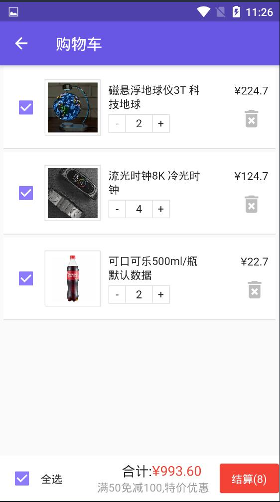

# __  Cool店 使用Flutter 开发的移动端电商APP应用.

### 简介:
>此项目是根据 [Flutter实战-移动电商](https://www.jspang.com/detailed?id=53) 完成, app主题色ui更改了, 图片来自网络, 图标图片来自[iconfont](https://www.iconfont.cn/), 数据则使用了fastmock在线Mock数据;

### 开发环境:
  > Flutter v1.17.4<br>
  >参考: [Fluter中文文档](https://flutterchina.club/get-started/install/).

### 项目结构:
```
lib
 ├─config               配置文件目录, 配置serviceUrl
 ├─model                各个页面的数据模型实体类对象
 ├─pages                页面组件的存放目录
 ├─provider             provider状态管理
 ├─routes               路由配置文件目录
 ├─service              全局http请求方法目录
 └─main.dart            main.dart入口主类

```

### 项目使用的依赖:
| 名称\选项           |  描述                  | 版本          |
| ---------          | :-----                | :---------:  |
| [cupertino_icons](https://github.com/flutter/cupertino_icons)    | flutter的图标库      |^0.1.2  |
| [dio](https://github.com/flutterchina/dio)                       | dart的http网络请求库 |^2.1.13 |
| [flutter_swiper](https://github.com/best-flutter/flutter_swiper) | 滑动轮播图组件       | ^1.1.6 |
| [flutter_screenutil](https://github.com/OpenFlutter/flutter_screenutil) |屏幕尺寸适配   | ^0.5.3 |
| [url_launcher](https://github.com/flutter/plugins/tree/master/packages/url_launcher/url_launcher) |    跳转链接 | ^5.1.2 |
| [flutter_easyrefresh](https://github.com/xuelongqy/flutter_easyrefresh) | 下拉刷新上拉加载组件|         ^2.0.4 |
| [provide](https://github.com/google/flutter-provide) |          provide状态管理       | ^1.0.2 |
| [fluttertoast](https://github.com/PonnamKarthik/FlutterToast)    |  提示toast通知组件 | ^3.1.3 |
| [flutter_html](https://github.com/Sub6Resources/flutter_html)    |flutter渲染html页面 | ^0.11.0 |
| [shared_preferences](https://github.com/flutter/plugins/tree/master/packages/shared_preferences) |数据持久化 | ^0.5.3 |
| [fastmock](www.fastmock.site)                                     |   在线Mock数据             |        /        |
| --------------------------------| ------------------------------ |   -------------------------  |


### 页面展示:

<div align="center">
   

   

   

   

   
 </div>


### 如何运行:
   1. 确保安装好FlutterSdk开发环境,cmd查看命令`flutter doctor`.

   2. 在项目根目录下运行`flutter pub get`下载依赖包.

   3. 连接好设备后, 在项目目录下运行`flutter run`即可.

   (参考: [flutter中文网](https://flutterchina.club/get-started/install/))


#### 最后:

   (一些Flutter Widget组件布局案例 [组件布局案例](https://github.com/pjqdyd/Flutter-demo/tree/master/Flutter%E7%BB%84%E4%BB%B6%E6%A1%88%E4%BE%8B))
   
